# Executive Summary: Oracle of Delphi (India Edition) 🇮🇳

## 🌧️ The Challenge
India's monsoon affects **650 million farmers** and drives **15% of GDP** (₹15 lakh crore agricultural economy). Yet:
-   **Climate interventions are fragmented** - No unified system to evaluate strategies.
-   **Policy decisions lack precision** - Which ₹50 crore project delivers maximum impact?
-   **Research is siloed** - IIT Bombay and IITM Pune don't have a shared decision tool.

**Result:** Sub-optimal resource allocation, reactive crisis management, missed intervention windows.

## 📌 Project Overview
The **Oracle of Delphi: India Edition** is a specialized AI-driven decision support system designed to aid Indian policymakers and climate scientists effectively manage Monsoon volatility.

It serves as a "War Room" interface where users can propose tactical interventions (e.g., *Cloud Seeding*, *Crop Switching*) and receive instant, scientifically grounded feasibility analyses aligned with Indian government policies.

## 🚀 Key Features

### 1. The Oracle Engine (Real-Time Reasoning)
*   **Natural Language Strategy Evaluation**: Decodes complex user intent (e.g., "Deploy aerosol injection over Kerala").
*   **Mechanism Matching**: Automatically links user strategies to a curated database of **30 curated intervention mechanisms**.
*   **Feasibility Scoring**: Computes a detailed confidence score (0-100%) based on physics viability, economic constraints, and geographic scalability.

### 2. Real-Time Geospatial War Room
*   **Interactive India Map**: A high-fidelity choropleth map showing real-time rainfall deviation by state (Red=Deficit, Blue=Excess).
*   **Streaming Intelligence**: The AI reasoning process is streamed live to the dashboard (NDJSON), visualizing the logic chain in real-time.

### 3. Scenario Backtesting Engine
*   **Historical Validation**: Test strategies against documented climate events:
    *   **2019 Maharashtra Drought** (-12% rainfall deficit, ₹45,000 crore impact)
    *   **2022 Central India Floods** (+18% excess, displacement of 2.3M people)
*   **Counterfactual Analysis**: "What if we had deployed cloud seeding in Week 2 of June 2019?"
*   **Accuracy Verification**: Compare AI recommendations to peer-reviewed post-mortems.

## 💡 Impact & Value

### For Policymakers (NITI Aayog, MoES, State Govts)
-   **Precision Funding**: Identify which specific ₹50 crore research project prevents ₹5,000 crore agricultural losses.
-   **Evidence-Based Decisions**: Every strategy backed by physics feasibility + economic ROI + policy alignment.
-   **Time Savings**: What takes 6 months of committee meetings now takes 3 minutes of AI analysis.

### For Researchers (IITM, IITs, ICAR)
-   **Research Prioritization**: System identifies high-impact bottlenecks (e.g., "Cloud seeding needs 4x coverage improvement").
-   **Funding Justification**: Automatically generates policy-aligned research proposals.
-   **Cross-Institution Collaboration**: Connects related work across IIT Bombay, CSIR, and ISRO.

### Quantified Impact
-   **₹1.5 lakh crore** agricultural GDP at risk annually from monsoon variability.
-   **4.5x improvement** in cloud seeding capability needed (system quantifies exact gap).
-   **30-90 day intervention windows** identified proactively, not reactively.

## 🛠️ Technical Architecture

### Why This Stack?
*   **Next.js 14 + React**: Server-side rendering for <2s page loads on BSNL networks (rural connectivity).
*   **FastAPI + Asyncio**: Streams AI reasoning in real-time (NDJSON) - users see "thinking" process, not just results.
*   **Custom LLM Logic Engine**: No OpenAI dependency - runs on local infrastructure for data sovereignty.
*   **GeoJSON + D3**: Renders 36-state choropleth map at 60fps on mid-tier devices.

### Data Sources
*   **Primary**: IMD Gridded Rainfall Data (0.25° resolution, 1901-2023).
*   **Economic**: RBI Agricultural GDP, PMFBY Insurance Payouts.
*   **Research**: IITM Pune, CSIR-NGRI, IISc publications (2020-2025).
*   **Demo Mode**: Cached datasets for offline reliability during live demos.

## 🚀 Roadmap & Scale Potential

### Phase 2 (Post-Hackathon)
-   **Expand to 8 NAPCC Missions**: Water, Agriculture, Coastal Zones, Himalayan Ecosystems.
-   **Real-Time Data Integration**: Live IMD API, ISRO satellite feeds.
-   **Multi-Stakeholder Dashboard**: Ministry-level (NITI Aayog), State-level (Disaster Management), District-level (Collectors).

### Phase 3 (6-12 Months)
-   **Pilot with Ministry of Earth Sciences (MoES)**: Monsoon Mission III integration.
-   **State Government Pilots**: Maharashtra, Karnataka (active cloud seeding states).
-   **Research Partnership**: Co-develop with IITM Pune, IIT Bombay.

### Long-Term Vision
Become the **de facto climate adaptation decision support platform** for South Asia, serving 1.9 billion people affected by monsoon-dependent agriculture.

## 🎯 What We Need

### For Hackathon Success
-   **Recognition** that this addresses a ₹15 lakh crore market opportunity.
-   **Feedback** from climate scientists or government officials in attendance.
-   **Visibility** to Ministry of Earth Sciences or NITI Aayog stakeholders.

### Post-Hackathon
-   **₹10-15 lakh seed funding** for 6-month pilot with 1 state government.
-   **Introductions** to IITM Pune, IMD, or state disaster management authorities.
-   **Mentorship** from climate tech accelerators or government innovation labs.

**We're not just building a demo—we're prototyping infrastructure for India's climate resilience.**

---

```mermaid
graph TD
    A[USER INPUT] -->|Deploy cloud seeding over Maharashtra| B(ORACLE ANALYSIS 3s)
    B --> C{Feasible?}
    C -->|Physics| D[Viable]
    C -->|Economics| E[₹50cr cost / ₹620cr benefit]
    C -->|Policy| F[Aligns with Monsoon Mission II]
    C -->|Research| G[IIT Bombay 4.5x gap]
    D & E & F & G --> H[ACTIONABLE OUTPUT]
    H -->|Fund these 3 labs| I[₹45cr / 18-month ROI]
```

