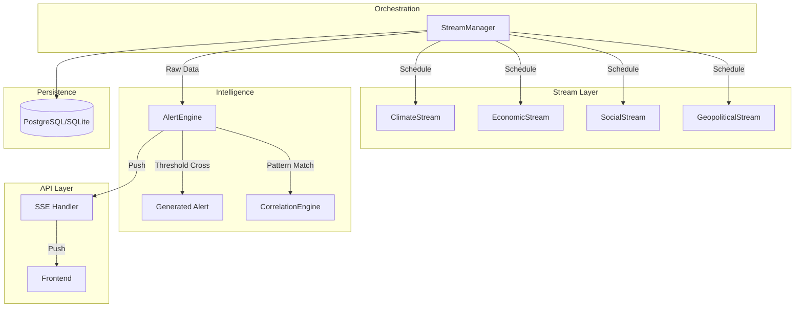

# Phase 2: 4-Stream Architecture Design

## 1. Stream Infrastructure
The core of the system is the **Stream Manager** which orchestrates 4 independent data gathering pipelines.

### BaseStream Interface
Every stream (Climate, Economic, Social, Geopolitical) implements this contract.

```python
from abc import ABC, abstractmethod
from typing import Dict, List, Any

class BaseStream(ABC):
    @abstractmethod
    async def scan(self) -> Dict[str, Any]:
        """
        Performs a data gathering pass.
        Returns: {
            "status": "healthy" | "degraded",
            "timestamp": int,
            "metrics": Dict[str, float], # Normalized 0-1 metrics
            "alerts": List[Alert]
        }
        """
        pass

    @abstractmethod
    def health_check(self) -> bool:
        """Quick connectivity check."""
        pass
```

### StreamManager Orchestrator
Central hub that prevents "poll hell".

- **Role**:
    - Schedules distinct intervals (e.g., Climate: 15m, Social: 5m).
    - Aggregates results into a single "World State" object.
    - Pushes updates to the `AlertEngine`.

## 2. Communication Protocol

### Backend Inter-Process
- **Direct Async Calls**: `StreamManager` calls `Stream.scan()` directly in an async loop. No internal REST overhead needed.
- **Event Bus**: An internal `Python Event Queue` will handle cross-stream messages (e.g., "Economic Stream wants to know Climate Risk").

### Backend -> Frontend (Real-time)
- **SSE (Server-Sent Events)**: Expanding the current `/stream` to a global `/api/world/stream`.
- **Channels**:
    - `world_heartbeat`: Healthy system pulses.
    - `stream_update`: Payload for a specific stream (e.g., "Social Sentiment dropped").
    - `alert_trigger`: High priority system alert.

## 3. Architecture Diagram


