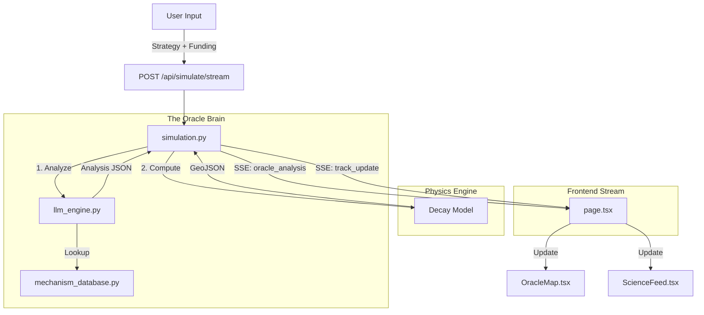

# Phase 1: System Audit & Mapping

## Component Inventory

### Frontend (Next.js 14)
- **Pages**:
  - `src/app/page.tsx`: Main dashboard (Controller).
- **Components**:
  - `OracleMap.tsx`: 3D Cesium Globe (Data Visualization).
  - `ScienceFeed.tsx`: Leverage Point Panel (Oracle Feedback).
  - `RadialOrbitalTimeline.tsx`: Simulation Progress Visualization.
  - `FundingSlider.tsx`: User Input Control.
- **State**:
  - `simulationStatus`: User interaction state.
  - `oracleAnalysis`: Structured analysis data.
  - `mitigatedData`: GeoJSON map overlays.

### Backend (FastAPI)
- **Core**:
  - `main.py`: API Gateway & SSE Streamer.
  - `simulation.py`: Physics & Orchestration Controller.
- **Oracle Brain**:
  - `oracle.py`: Application Logic Wrapper.
  - `reasoning/llm_engine.py`: Semantic Reasoning (The Oracle).
  - `reasoning/mechanism_database.py`: Ground Truth Data.
- **Data Engine**:
  - `scripts/fetch_idata.py`: ETL - Download.
  - `scripts/process_data.py`: ETL - Transform.

## Data Flow Diagram

## API Contract (Current)
- `POST /api/simulate/stream`
    - Input: `{ "user_input": string, "investment": float }`
    - Output: SSE Stream of serialized JSON events:
        - `{"status": "progress", "progress": int, "message": string}`
        - `{"status": "oracle_analysis", "data": {...}}`
        - `{"status": "complete", "score": float, "lives_saved": int, "mitigated_data": GeoJSON}`

